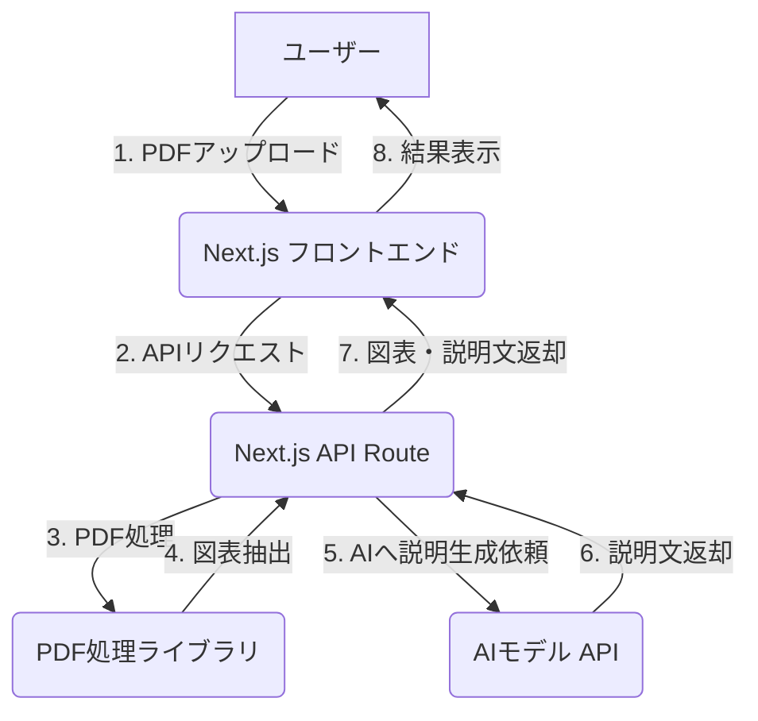

# 技術設計書: PDF図表抽出・説明アプリ

## 1. アーキテクチャ概要

Next.jsを用いたサーバーサイドレンダリング（SSR）とクライアントサイドレンダリング（CSR）を組み合わせたアーキテクチャを採用する。バックエンド処理はNext.jsのAPI Routesに実装し、フロントエンドと疎結合な構成とする。

## 2. フロントエンド設計

### 2.1. コンポーネント設計

- **`PdfUploadForm.tsx`**: PDFファイルのアップロードフォームコンポーネント。ドラッグ＆ドロップ機能も実装。
- **`DiagramList.tsx`**: 抽出された図表を一覧表示するコンポーネント。
- **`DiagramViewer.tsx`**: 選択された図表とAIによる説明文を表示するコンポーネント。
- **`LoadingSpinner.tsx`**: 処理中のローディングスピナー。

### 2.2. 状態管理

- Reactの`useState`および`useContext`を用いて、以下の状態を管理する。
  - アップロードされたPDFファイル
  - 抽出された図表のリスト
  - 選択中の図表
  - AIによる説明文
  - ローディング状態

## 3. バックエンド設計 (API Routes)

### 3.1. APIエンドポイント

- **`POST /api/extract`**: PDFファイルを受け取り、図表の抽出と説明文の生成を行う。

### 3.2. PDF処理

- `pdf2json`や`pdf-parse`などのライブラリを使用して、PDFからテキストや画像を抽出する。
- 画像やテーブルの領域を特定し、個別のファイルとして保存またはメモリ上で管理する。

### 3.3. AI連携

- 抽出した図表（画像の場合はBase64エンコードした文字列）を、マルチモーダル対応のAIモデル（例: Gemini Pro Vision）に送信する。
- AIに対して、図表の内容を分かりやすく説明するようなプロンプトを与える。

## 4. データフロー

1. ユーザーが`PdfUploadForm`コンポーネントを使ってPDFをアップロードする。
2. フロントエンドは、`fetch` APIを用いて`/api/extract`にPDFファイルをPOSTする。
3. バックエンド（API Route）は、PDF処理ライブラリを使って図表を抽出する。
4. 抽出した各図表について、AIモデルのAPIを呼び出し、説明文の生成を依頼する。
5. バックエンドは、抽出した図表（画像URLなど）と説明文のペアのリストをフロントエンドに返す。
6. フロントエンドは、受け取ったデータを状態に保存し、`DiagramList`と`DiagramViewer`コンポーネントを更新して結果を表示する。

## 5. 使用ライブラリ・ツール

- **フロントエンド**: Next.js, React, TypeScript, Tailwind CSS, react-dropzone
- **バックエンド (API Routes)**: `pdf2json`, `@google/generative-ai`
- **その他**: `axios` (HTTPクライアント)
